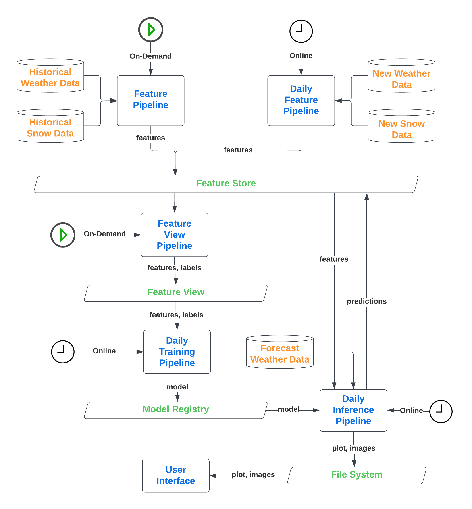

# Predicting Snow Conditions

Contributors:
<a href="https://github.com/Bralli99">Brando Chiminelli</a>, 
<a href="https://github.com/boyscout99">Tommaso Praturlon</a>

Course: <a href="https://id2223kth.github.io/">Scalable Machine Learning and Deep Learning</a>, at <a href="https://www.kth.se/en">KTH Royal Institute of Technology</a>

## About

The project is about building an automated and scalable system that predicts the snow conditions for [Passo Rolle](https://goo.gl/maps/G3Qw8WNvZ19ojKEK7) (ski area in Trento, Italy) for the upcoming week, so that a skier that the plans to go skiing on the next weekend, can look in advance if the conditions are good. 
In particular, the system predicts the ground snow level, and give advices to skiers based on what it predicted, the forecasted visibility and wind condition, three important factors for fun and safe skiing.

## Project's Architecture
An overview of the project's architecture is present below and all its different components are explained below.
 

### Data Model
The first thing to look for when dealing with a prediction service is to look for good quality data that is updated regualrly. In this project we are dealing with data that is updated every day from a verified source.

To predict the snow level we need to think which factors contribute the most to its increase/decrease. The ones used in this project are taken from [Open-Meteo](https://open-meteo.com/) and are the following:
* Weathercode: Weather condition as a numeric code. Follow WMO weather interpretation codes.
* Temperature: Temperature taken distinctly as max/min of the day.
* Precipitation: Sum of daily precipitation (divided into rain, showers and snowfall).
* Precipitation hours: The number of hours with precipitation.

The historical data for the snow level is provided by [Open Data Trentino](https://dati.trentino.it/), which, unfortunately, gives only the last eight days of data. Nevertheless, the system has been collecting data every day since the 6th of December, 2022, so the dataset keeps growing and predictions keep getting better.

By looking at the project's architecture diagram, it is clear that the system does not only collect static historical data, but deals with new data ingestions every day, resulting in updated and useful future predictions.

### Feature Pipeline
Data is ingested into [Hopsworks](https://www.hopsworks.ai/) Feature Store with the help of two main pipelines: one for historical data and one for fresh new data. The first one runs on demand as it takes a batch of historical data, does some data cleaning, and writes the final result to a feature group (one called `weather_data` and the other `snow_data`).

The second pipeline, takes the latest weather and snow data, does some data cleaning and adds a row on both the two feature groups. This last pipeline runs every day as the data coming from the two data sources is updated once per day. To make it running every day the pipeline runs on a container in the cloud, completely handled by [Modal](https://modal.com/).

Lastly, a Feature View is created by joining the two feature groups created before, `weather_data` and `snow_data`. 
A Feature View is a logical view over the data present on the join of the two feature groups and it is an easy way to redefine data types and specify a label, which is needed for the training pipeline.

### Training Pipeline
The training pipeline runs every day on Modal so that the model can improve in time, since it's trained every day with more data. The training starts by retrieving the data from the Feature View with a specific function `feature_view.training_data()` and then performs three operations on the data:
1. Orders the data by time (ascending order);
2. Removes the time feature, as we don't need that for training;
3. Splits the data into train (the first 80%) and test (the last 20%) set.

The model used for training is a gradient boosted decision tree. Specifically, it is the XGBoost Python model implementation with the scikit-learn API via the XGBRegressor wrapper class.
After trying with different configurations, the parameters that work best, and therefore that are selected for the training, are:
* `'max_depth': 3` = Maximum depth of a tree. Increasing this value will make the model more complex and more likely to overfit.
* `'objective': 'reg:squarederror'` = The loss function 'reg:squarederror' is suitable for regression predictive modeling problems.
Other parameters, such as `n_estimators` and `learning_rate` were providing very little or no improvement to the training, so were discarded.

The model is then trained with the train set and later its evaluation metric Root Mean Square Error (RMSE) is calculated upon the test set. Hopsworks provides a Model Registry where the model can be saved together with its version number and the value for RSME.

### Inference Pipeline
The inference pipeline is responsible for making the predictions by using the best model trained so far (based on the evaluation metric). Moreover, it writes all its predictions on the `snow_predictions` feature group and runs on Modal everyday, so that the predictions improve as we get closer to the ski weekend (as the weather forecast will also improve). Lastly, the inference pipeline generates a plot for historical values of snow levels and the corresponding predicted values. It also generates an advice for the skier in the form of an emoji, which is, together with the plot, saved to the Hopsworks File System.

### User Interface
The User Interface simply shows the latest predictions and the historical values for snow level in Passo Rolle and gives advices to skiers for the upcoming weekend. It shows a plot and some images that are present and updated daily on Hopsworks File System.

## Built With

* [Hopsworks](https://www.hopsworks.ai/)
* [Modal](https://modal.com/)

## Hugging Face - User Interface

Run the application on Hugging Face from [here](https://huggingface.co/spaces/whispy/Snow-Level-Forecast-in-Passo-Rolle).
